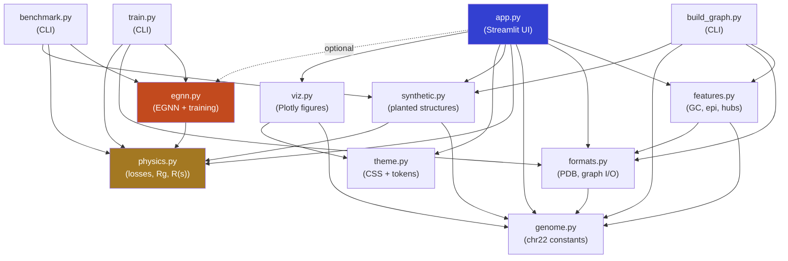

# ChronoCell-5D — Architecture

> 3D chromatin workstation for human chr22 (GRCh38) at 10 kb resolution:
> contact-embedding reconstruction refined by an E(3)-equivariant graph network,
> with polymer-physics analytics and wwPDB-conformant export.

---

## Table of Contents

1. [Project Overview](#1-project-overview)
2. [High-Level Architecture Diagram](#2-high-level-architecture-diagram)
3. [Directory Structure](#3-directory-structure)
4. [Pipeline Stages](#4-pipeline-stages)
5. [Module Reference](#5-module-reference)
   - 5.1 [app.py — Streamlit application](#51-apppy--streamlit-application)
   - 5.2 [chronocell/genome.py — Reference genome constants](#52-chronocellgenomepy--reference-genome-constants)
   - 5.3 [chronocell/features.py — Per-bin feature extraction](#53-chronocellfeaturespy--per-bin-feature-extraction)
   - 5.4 [chronocell/physics.py — Polymer physics engine](#54-chronocellphysicspy--polymer-physics-engine)
   - 5.5 [chronocell/egnn.py — E(3)-equivariant graph neural network](#55-chronocellegnnpy--e3-equivariant-graph-neural-network)
   - 5.6 [chronocell/synthetic.py — Synthetic ground truth generator](#56-chronocellsyntheticpy--synthetic-ground-truth-generator)
   - 5.7 [chronocell/formats.py — File I/O and PDB export](#57-chronocellformatspy--file-io-and-pdb-export)
   - 5.8 [chronocell/viz.py — Plotly figure builders](#58-chronocellvizpy--plotly-figure-builders)
   - 5.9 [chronocell/theme.py — Design tokens and CSS](#59-chronocellthemepy--design-tokens-and-css)
   - 5.10 [chronocell/build_graph.py — Graph builder CLI](#510-chronocellbuild_graphpy--graph-builder-cli)
   - 5.11 [chronocell/train.py — Reconstruction CLI](#511-chronocelltrainpy--reconstruction-cli)
   - 5.12 [chronocell/benchmark.py — Reconstruction benchmark](#512-chronocellbenchmarkpy--reconstruction-benchmark)
6. [Test Suite](#6-test-suite)
7. [Configuration Files](#7-configuration-files)
8. [Legacy Code](#8-legacy-code)
9. [Dependency Graph](#9-dependency-graph)
10. [Technology Stack](#10-technology-stack)

---

## 1. Project Overview

**ChronoCell-5D** reconstructs the three-dimensional spatial fold of human chromosome 22 from:

- **Micro-C contact frequencies** (how often genomic loci are found in proximity)
- **H3K27ac ChIP-seq signal** (an epigenomic mark of active enhancers)
- **DNA sequence composition** (GC content per 10 kb bin)

The reconstruction pipeline uses:

1. A **contact embedding** that converts pairwise contact frequencies into target spatial distances using the power-law relationship M ∝ d⁻ᵅ, then optimises free 3D coordinates to satisfy those distances.
2. An **E(3)-equivariant graph neural network (EGNN)** that refines the coordinates conditioned on genomic features (GC content, H3K27ac), producing a structure that is equivariant to all rotations, reflections, and translations.

The interactive **Streamlit web app** provides a polymer-physics inspector, 3D viewport (lit triangle-mesh tube), contact/distance maps, genomic-feature tracks, and wwPDB-conformant PDB export.

---

## 2. High-Level Architecture Diagram

```
┌───────────────────────────────────────────────────────────────────────┐
│                        USER INTERFACE (app.py)                       │
│  ┌───────────┐  ┌──────────────┐  ┌──────────┐  ┌────────────────┐  │
│  │  Data I/O  │  │  3D Viewport │  │Inspector │  │    Export       │  │
│  │  popovers  │  │  (Plotly 3D) │  │  panels  │  │ PDB/XYZ/CSV   │  │
│  └─────┬─────┘  └──────┬───────┘  └─────┬────┘  └───────┬────────┘  │
│        │               │                │               │            │
│  ┌─────▼───────────────▼────────────────▼───────────────▼─────────┐  │
│  │                    theme.py  +  viz.py                         │  │
│  │             (CSS design tokens)  (Plotly figures)              │  │
│  └────────────────────────────────────────────────────────────────┘  │
└──────────────────────────────┬────────────────────────────────────────┘
                               │  uses
┌──────────────────────────────▼────────────────────────────────────────┐
│                     CORE LIBRARY (chronocell/)                       │
│                                                                      │
│  ┌──────────┐   ┌──────────┐   ┌───────────┐   ┌──────────────────┐ │
│  │ genome.py│   │features.py│  │ physics.py│   │    egnn.py       │ │
│  │ chr22    │   │ GC, epi  │   │ losses,   │   │ EGNN model,      │ │
│  │ constants│   │ binning  │   │ R(s), Rg, │   │ fit_structure(), │ │
│  │ bands    │   │ hubs     │   │ neighbour │   │ equivariance     │ │
│  └────┬─────┘   └────┬─────┘  │ search    │   │ check            │ │
│       │              │        └─────┬─────┘   └───────┬──────────┘ │
│       │              │              │                  │            │
│  ┌────▼──────────────▼──────────────▼──────────────────▼─────────┐  │
│  │                      formats.py                               │  │
│  │  PDB/XYZ read+write, .npz/.pt loaders, graph I/O, JSON report│  │
│  └───────────────────────────────────────────────────────────────┘  │
│                                                                      │
│  ┌────────────────────────────────────────────────────────────────┐  │
│  │                     synthetic.py                               │  │
│  │  Hilbert-curve fractal globule, band-informed tracks,         │  │
│  │  Poisson Micro-C contacts → planted ground truth              │  │
│  └────────────────────────────────────────────────────────────────┘  │
│                                                                      │
│  ┌───────────────┐  ┌──────────────┐  ┌────────────────────────┐    │
│  │ build_graph.py│  │  train.py    │  │   benchmark.py         │    │
│  │  CLI: FASTA + │  │  CLI: graph →│  │   CLI: planted-struct  │    │
│  │  bigWig +     │  │  3D coords   │  │   accuracy table       │    │
│  │  mcool → .npz │  │  + PDB + CSV │  │                        │    │
│  └───────────────┘  └──────────────┘  └────────────────────────┘    │
└──────────────────────────────────────────────────────────────────────┘

┌──────────────────────────────────────────────────────────────────────┐
│                         TEST SUITE (tests/)                          │
│  test_core.py — genome, physics identities, formats, features       │
│  test_egnn.py — E(3) equivariance, gradient stability, accuracy     │
└──────────────────────────────────────────────────────────────────────┘
```

---

## 3. Directory Structure

```
ChronoCell-5D/
├── app.py                          # Streamlit web application (entry point)
├── requirements.txt                # Python dependencies
├── pytest.ini                      # Pytest configuration
├── README.md                       # Project overview & quickstart
├── AUDIT.md                        # Flaw-by-flaw audit of v1, corrected equations, benchmark
│
├── chronocell/                     # Core Python package
│   ├── __init__.py                 # Empty init (namespace package)
│   ├── genome.py                   # GRCh38 chr22 constants (bands, gaps, centromere)
│   ├── features.py                 # Per-bin GC fraction, H3K27ac binning, enhancer hubs
│   ├── physics.py                  # Polymer physics: losses, R(s), Rg, Kabsch RMSD, cell-list
│   ├── egnn.py                     # E(3)-equivariant GNN model + two-stage training loop
│   ├── synthetic.py                # Planted fractal globule + synthetic tracks + contacts
│   ├── formats.py                  # PDB/XYZ/NPZ/PT/CSV I/O, graph loaders, JSON report
│   ├── viz.py                      # Plotly 3D viewport (tube mesh), 2D analytics charts
│   ├── theme.py                    # CSS design tokens, colour scales, Streamlit injection
│   ├── build_graph.py              # CLI: raw files → graph .npz
│   ├── train.py                    # CLI: graph → reconstructed coordinates
│   └── benchmark.py                # CLI: reconstruction accuracy on planted structures
│
├── tests/                          # Pytest test suite (21 tests)
│   ├── test_core.py                # Physics, genome, formats, features verification
│   └── test_egnn.py                # EGNN equivariance, gradients, reconstruction quality
│
│
├── .streamlit/                     # Streamlit configuration
│   └── config.toml                 # Theme tokens, upload limits, server settings
│
└── *.pdf                           # Team specification documents
```

---

## 4. Pipeline Stages

The project operates in three stages, which can be run independently:

### Stage 1 — Graph Assembly (`build_graph.py`)

```
FASTA (chr22.fa)  ──┐
                    ├──► build_graph.py ──► graph_chr22.npz
bigWig (H3K27ac)  ──┤     or --synthetic        (gc, epi, valid, ci, cj, cm)
                    │
mcool (Micro-C)   ──┘
```

- **Input**: Raw genomic files (FASTA sequence, bigWig epigenomic signal, mcool contact matrix) — or `--synthetic` flag for planted ground truth.
- **Processing**: Computes GC fraction per 10 kb bin (`features.gc_fraction`), bins the H3K27ac signal (`features.binned_mean`), extracts canonical upper-triangle contacts from the cooler pixel table (`features.contacts_from_pixels`).
- **Output**: Compressed `.npz` file with arrays `gc`, `epi`, `valid`, `ci`, `cj`, `cm` plus metadata.

### Stage 2 — 3D Reconstruction (`train.py`)

```
graph_chr22.npz ──► train.py ──► predicted_coords.npz
                                  predicted_coords.pdb
                                  predicted_coords_history.csv
```

- **Input**: Graph `.npz` (or legacy `.pt`), optional `--start`/`--end` window, optional `--truth` for accuracy.
- **Processing**: Two-stage optimisation inside `egnn.fit_structure()`:
  1. **Contact embedding** (phantom chain → excluded volume): Free 3D coordinates are initialised via shortest-path MDS and optimised against a contact-distance loss, a harmonic backbone loss, and a soft-core steric loss.
  2. **EGNN refinement**: An E(3)-equivariant graph neural network conditions the output on GC and H3K27ac node features, jointly optimising network weights and coordinates.
- **Output**: Coordinates (nm), per-epoch loss history, wwPDB PDB file.

### Stage 3 — Interactive Analysis (`app.py`)

```
predicted_coords.npz ──┐
                       ├──► Streamlit app  ──► browser (localhost:8501)
graph_chr22.npz        ──┘
```

- **Input**: Uploads via the web UI (coordinates + graph), or synthetic fallback.
- **Features**: 3D lit-tube viewport, polymer-physics inspector (Rg, Re, ν, bond histogram, excluded-volume overlaps), genomic tracks (GC, H3K27ac), contact/distance maps, contact-decay P(s), enhancer-hub table, in-app reconstruction, E(3) equivariance verification, PDB/XYZ/CSV/JSON export.

---

## 5. Module Reference

---

### 5.1 `app.py` — Streamlit Application

| Attribute | Details |
|---|---|
| **Role** | Orchestrates UI state, layout, and user interaction. Contains zero numerics. |
| **Size** | 633 lines · 38,325 bytes |
| **Entry point** | `streamlit run app.py` |

**Key components:**

| Component | Purpose |
|---|---|
| `Dataset` (dataclass) | Immutable container holding coordinates, GC, epi, valid mask, contacts, and metadata for one loaded session. |
| `load_dataset()` | Cached resource: loads user-uploaded files or falls back to the synthetic chromosome. Handles unit calibration (nm, Å, µm, model units). |
| `stage()` (`@st.fragment`) | The 3D viewport fragment — re-renders only on display setting changes (colour, style, radius) without re-running analysis or inference. |
| Top bar | Brand, Data popover (file uploaders, unit picker, synthetic seed), Method popover (b₀, α, d_min), About popover. |
| Region control | Segmented control for whole / centromere / telomeres / enhancer hubs / custom window, with a chr22 ideogram. |
| Inspector panels | 01 Polymer physics, 02 Genomic features, 03 Model & convergence, 04 Export — each as a collapsible expander. |
| Status bar | Footer showing structure source, tracks source, and active physical parameters. |

**Imports from `chronocell`:** `features`, `formats`, `genome`, `physics`, `synthetic`, `theme`, `viz`, and optionally `egnn` (if PyTorch is installed).

---

### 5.2 `chronocell/genome.py` — Reference Genome Constants

| Attribute | Details |
|---|---|
| **Role** | Single source of truth for all GRCh38/hg38 chr22 genomic coordinates. |
| **Size** | 124 lines · 5,001 bytes |
| **Dependencies** | `numpy` (only) |

**Key constants:**

| Constant | Value | Description |
|---|---|---|
| `CHROM_SIZE` | 50,818,468 bp | Total chromosome length |
| `RESOLUTION` | 10,000 bp | Bin size (bead resolution) |
| `N_BINS` | 5,082 | Number of beads (last bin is 8,468 bp) |
| `CYTOBANDS` | 16 bands | UCSC hg38 cytoBand track (stain, start, end, name) |
| `GAPS` | 45 entries | UCSC hg38 gap track (all N-runs in chr22) |
| `ACEN` | (13.7 Mb, 17.4 Mb) | Cytogenetic centromere boundaries |

**Key functions:**

| Function | Purpose |
|---|---|
| `bin_start(i)` / `bin_end(i)` | Convert bin index ↔ base-pair coordinates |
| `gap_fraction(n)` | Exact per-bin fraction covered by assembly gaps |
| `assembled_mask(n)` | Boolean mask: `True` for bins with ≥ 50% sequence |
| `band_for_bins(n)` | Map each bin to its cytogenetic band |
| `locus(i)` | UCSC-style 1-based locus string (e.g. `chr22:10,000,001-10,010,000`) |

---

### 5.3 `chronocell/features.py` — Per-Bin Feature Extraction

| Attribute | Details |
|---|---|
| **Role** | Computes corrected GC fraction and H3K27ac signal per 10 kb bin; identifies enhancer hubs. |
| **Size** | 90 lines · 4,048 bytes |
| **Dependencies** | `genome`, `formats` |

**Key functions:**

| Function | Purpose |
|---|---|
| `gc_fraction(sequence, ...)` | f_GC = #{G,C} / #{A,C,G,T} (case-insensitive). N-only bins → NaN. Fixes the v1 bug of dividing by constant 10,000. |
| `binned_mean(values, ...)` | NaN-aware per-bin mean of base-resolution signals (e.g. pyBigWig output). |
| `signal_hubs(epi, valid, ...)` | Finds runs of bins whose 5-bin-smoothed H3K27ac exceeds the 97th percentile. Returns `(start, end, peak)` sorted by peak strength. |
| `contacts_from_pixels(...)` | Converts a cooler pixel table to canonical upper-triangle contacts via `formats.canonical_contacts`. |

---

### 5.4 `chronocell/physics.py` — Polymer Physics Engine

| Attribute | Details |
|---|---|
| **Role** | All polymer-physics computations: structure descriptors, loss functions, contact ↔ distance mapping, neighbour search, structure comparison. Pure NumPy (no autograd). |
| **Size** | 358 lines · 16,868 bytes |
| **Dependencies** | `numpy` (only) |

**Physical constants:**

| Constant | Value | Meaning |
|---|---|---|
| `B0_NM` | 50.0 nm | Bond rest length for a 10 kb bead |
| `ALPHA` | 3.0 | Contact-frequency/distance power-law exponent (capture volume) |
| `D_MIN_FACTOR` | 0.8 | Excluded-volume diameter as fraction of b₀ |
| `TARGET_CLIP` | (0.8, 8.0) | Clipping range for target distances (× b₀) |

**Sub-systems:**

| Sub-system | Key Functions | Description |
|---|---|---|
| **Shape descriptors** | `radius_of_gyration()`, `end_to_end()`, `bond_lengths()`, `calibrate_to_bond_length()` | Global polymer metrics |
| **Distance scaling** | `distance_scaling()`, `classify_regime()` | R(s) ∝ sᵛ fit with OLS, regime classification (fractal globule / ideal / SAW / etc.) |
| **Neighbour search** | `neighbor_pairs()` | O(N) cell-list for all pairs (i < j) with ‖xᵢ − xⱼ‖ < r and \|i−j\| ≥ min_sep. Never scales as N². |
| **Contact ↔ distance** | `reference_count()`, `contact_target_distance()` | d\*ᵢⱼ = b₀ · (Mᵢⱼ/M_ref)^(−1/α), anchored at the median nearest-neighbour count. |
| **Loss functions** | `loss_contact()`, `loss_smooth()`, `loss_steric()` | NumPy evaluation of the three loss terms (dimensionless, divided by b₀). |
| **Structure comparison** | `kabsch_rmsd()`, `distance_correlation()` | Optimal superposition over O(3) (including mirror), Pearson correlation of pairwise distances. |
| **2D maps** | `coarse_distance_map()`, `coarse_contact_map()`, `contact_decay()` | Block-averaged matrices and P(s) decay with power-law fit. |

---

### 5.5 `chronocell/egnn.py` — E(3)-Equivariant Graph Neural Network

| Attribute | Details |
|---|---|
| **Role** | PyTorch implementation of the EGNN layer (Satorras, Hoogeboom & Welling, ICML 2021), stabilised for chromatin-scale distances, plus the two-stage reconstruction pipeline. |
| **Size** | 434 lines · 20,880 bytes |
| **Dependencies** | `torch`, `physics` |

**Model architecture:**

| Component | Description |
|---|---|
| `RadialBasis` | Gaussian RBF on d/b₀ — bounded, smooth, invariant edge embedding (16 centres, cutoff 8.0). |
| `EGNNLayer` | One message-passing layer: φ\_e (edge MLP), φ\_x (coordinate update, bounded by s·tanh), φ\_h (feature update + LayerNorm). Uses unit direction vectors and mean aggregation. |
| `ChromatinEGNN` | Stack of `n_layers` (default 3) EGNN layers with a linear node embedding. |

**Key design choices (stabilisation over vanilla EGNN):**

- **Unit direction** `(xᵢ − xⱼ) / (dᵢⱼ + ε)` instead of raw difference — prevents distance-proportional jumps.
- **Mean aggregation** `1/|N(i)|` — degree-normalised to handle high-degree Micro-C hubs.
- **Bounded step** `s · tanh(φ_x(m))` — limits per-layer displacement.
- **Smooth distance** `√(‖v‖² + ε²)` — defined gradient at coincident beads.
- **RBF(d/b₀)** instead of raw d² — prevents MLP saturation.

**Training pipeline (`fit_structure()`):**

| Stage | Description |
|---|---|
| **1. Contact embedding** | Free coordinates initialised by `shortest_path_mds()` (or `random_walk()`). First 30% of epochs are phantom (no steric); excluded volume then switches on via Verlet neighbour list. |
| **2. EGNN refinement** | `X = EGNN(P \| GC, H3K27ac)` jointly optimised with free coords P. AdamW with cosine annealing. |

**Other key functions:**

| Function | Purpose |
|---|---|
| `build_message_graph()` | Sparse, symmetric graph: backbone (\|i−j\| ∈ {1,2}) + k-top contacts per node. Edge attributes: normalised log-count, log-separation, backbone flag. |
| `node_features()` | `[z(f_GC), z(log1p(f_epi)), assembled_flag]` — standardised, log-transformed, with NaN-safe handling. |
| `shortest_path_mds()` | ShRec3D-style initialisation: Floyd-Warshall shortest paths on the contact graph → classical MDS embedding in 3D. Coarse-grains large windows for O(m³) tractability. |
| `equivariance_check()` | Numerical verification: f(Qx + t) = Q·f(x) + t and h(Qx + t) = h(x) in float64 with enlarged weights. |

---

### 5.6 `chronocell/synthetic.py` — Synthetic Ground Truth Generator

| Attribute | Details |
|---|---|
| **Role** | Generates a complete planted chromosome: known 3D structure + realistic 1D tracks + Poisson contacts — so reconstructions can be scored against ground truth. |
| **Size** | 221 lines · 10,219 bytes |
| **Dependencies** | `genome`, `physics` |

**Key components:**

| Component | Purpose |
|---|---|
| `hilbert_curve_3d()` | Vectorised Skilling transpose algorithm. Produces a space-filling, unknotted Hilbert curve with R(s) ∝ s^(1/3). |
| `fractal_globule()` | Full planted conformation: Hilbert curve → spherical squash → plane-wave bending → Gaussian smoothing → position-based relaxation (PBD) to enforce bonds and excluded volume. |
| `relax()` | Iterative relaxation: resolves steric overlaps and restores bond lengths using vectorised scatter operations on a Verlet neighbour list. |
| `synthetic_tracks()` | GC fraction and H3K27ac signal modulated by cytogenetic band staining (Giemsa-negative = GC-rich, G-positive = AT-rich), with super-enhancer-like hubs. |
| `simulate_contacts()` | Poisson-sampled contact counts: mean ∝ (d/b₀)^(−α) for pairs within 2.5 b₀, zero for unassembled bins. |
| `SyntheticChromosome` | Dataclass bundling coords, gc, epi, valid, ci, cj, cm, metadata. |

---

### 5.7 `chronocell/formats.py` — File I/O and PDB Export

| Attribute | Details |
|---|---|
| **Role** | Reads and writes all supported file formats. The PDB writer is wwPDB v3.3 column-conformant with a custom unit policy (nanometres, not Ångström). |
| **Size** | 413 lines · 17,774 bytes |
| **Dependencies** | `genome` |

**PDB unit policy**: Coordinates are in nanometres, shifted into the positive octant, scaled by powers of 10 if needed to fit the `%8.3f` columns. `REMARK 250` records make the mapping exactly invertible.

**Key functions:**

| Function | Purpose |
|---|---|
| `atom_record()` | Generates one wwPDB ATOM record with every field in its fixed column. |
| `write_pdb()` | Full PDB file: HEADER, TITLE, REMARK 2/250, CRYST1, ATOM records, TER, CONECT (backbone only), END. Occupancy = f_GC, B-factor = log-scaled H3K27ac. |
| `validate_pdb()` | Column-level conformance checker: decimal-point alignment, serial sequence, separator blanks, CONECT reciprocation, element symbol alignment. |
| `read_pdb()` | Reads ATOM/HETATM coordinates; undoes the ChronoCell unit/offset transform if REMARK 250 is present. |
| `write_xyz()` / `read_xyz()` | Simple XYZ format with units metadata in the comment line. |
| `read_structure()` | Unified loader dispatching on extension: `.pdb`, `.xyz`, `.npy`, `.npz`, `.csv`, `.pt`/`.pth`. |
| `read_graph()` | Loads graph from `.npz` (native format) or `.pt` (legacy PyG Data). Calls `canonical_contacts()` to de-duplicate. |
| `canonical_contacts()` | Upper-triangle, off-diagonal, de-duplicated, strictly positive contacts. Drops the diagonal and merges mirrored pixels. |
| `report_json()` | JSON export of structure metrics, provenance, and parameters (NaN-safe, NumPy-aware serialiser). |

---

### 5.8 `chronocell/viz.py` — Plotly Figure Builders

| Attribute | Details |
|---|---|
| **Role** | Pure functions: (data, display options) → Plotly `Figure`. No physics, no state. |
| **Size** | 350 lines · 20,337 bytes |
| **Dependencies** | `genome`, `theme` |

**3D rendering pipeline:**

| Step | Function | Description |
|---|---|---|
| 1 | `catmull_rom()` | Uniform Catmull-Rom spline through bead centres — smooth backbone path. |
| 2 | `tube_mesh()` | Sweeps a circle along the spline with rotation-minimising frames (cumulative-twist correction). Produces capped triangle mesh. |
| 3 | `level_of_detail()` | Adapts (spline density × ring sides) to keep the mesh under ~70k vertices. |
| 4 | `encode()` | Maps data values to `[0, 1]` intensity with three flat states: unassembled (0), outside-focus (0.03), data (≥0.06). |
| 5 | `viewport()` | Assembles the full 3D scene: tube/beads/line traces + context chromosome + end labels + scale bar + turntable animation + camera presets. |

**2D analytics charts:**

| Function | Chart |
|---|---|
| `scaling_chart()` | Log-log R(s) vs s with reference-exponent guide lines (ν = 1/3, 1/2, 0.59). |
| `bond_histogram()` | Distribution of bond lengths / b₀ with a dashed reference at 1.0. |
| `tracks_chart()` | Aligned small-multiples: GC fraction and H3K27ac signal vs. chromosomal position. |
| `matrix_chart()` | Contact map (log₁₀(1+M)) or distance map (nm) as a heatmap. |
| `decay_chart()` | Contact decay P(s) on log-log axes. |
| `loss_chart()` | Training convergence: L\_contact, λ₁·L\_smooth, λ₂·L\_steric, L\_total vs. epoch. |

---

### 5.9 `chronocell/theme.py` — Design Tokens and CSS

| Attribute | Details |
|---|---|
| **Role** | Defines the complete visual identity: colour palette, typography, WCAG-compliant contrast ratios, and a full CSS stylesheet injected via `st.markdown`. |
| **Size** | 186 lines · 11,360 bytes |
| **Dependencies** | `streamlit` |

**Design language**: Warm paper ground (`#F2F2EF`), near-black ink (`#1C1E1B`), cobalt accent (`#3340D1`), terracotta/ochre data colours. All text colours meet WCAG AA or AAA contrast on the paper background. Data colours meet the 3:1 non-text minimum (WCAG 1.4.11).

**Colour scales for 3D rendering:**

| Scale | Colours | Use |
|---|---|---|
| Genomic position | Cobalt → Violet → Terracotta → Ochre | Default rainbow-free position encoding |
| GC content | Light blue → Cobalt → Dark navy | AT-rich to GC-rich |
| H3K27ac | Peach → Terracotta → Dark brown | Low to high signal |
| Monochrome | Near-black | Structural emphasis, focus highlighting |

---

### 5.10 `chronocell/build_graph.py` — Graph Builder CLI

| Attribute | Details |
|---|---|
| **Role** | Command-line entry point for Stage 1. Reads raw genomic files or generates synthetic data, then writes a graph `.npz`. |
| **Size** | 73 lines · 2,927 bytes |
| **Entry point** | `python -m chronocell.build_graph` |
| **Dependencies** | `features`, `formats`, `genome`, `synthetic`; optionally `pyfaidx`, `pyBigWig`, `cooler` |

**Usage:**
```bash
# Real data
python -m chronocell.build_graph --fasta chr22.fa --bigwig H3K27ac.bigWig --mcool human.mcool --out graph.npz

# Synthetic (no external files needed)
python -m chronocell.build_graph --synthetic --out graph_synthetic.npz
```

---

### 5.11 `chronocell/train.py` — Reconstruction CLI

| Attribute | Details |
|---|---|
| **Role** | Command-line entry point for Stage 2. Runs the full reconstruction pipeline and writes coordinates + PDB + history. |
| **Size** | 64 lines · 2,939 bytes |
| **Entry point** | `python -m chronocell.train` |
| **Dependencies** | `egnn`, `formats`, `physics` |

**Usage:**
```bash
python -m chronocell.train --graph graph_chr22.npz --out predicted_coords.npz \
    [--start 2600 --end 3400] [--refine-epochs 100] [--truth truth.npz]
```

**Outputs:** `predicted_coords.npz`, `predicted_coords.pdb`, `predicted_coords_history.csv`

---

### 5.12 `chronocell/benchmark.py` — Reconstruction Benchmark

| Attribute | Details |
|---|---|
| **Role** | Measures reconstruction accuracy across five genomic windows and four method arms on planted fractal globules. Outputs a Markdown comparison table. |
| **Size** | 34 lines · 1,656 bytes |
| **Entry point** | `python -m chronocell.benchmark` |
| **Dependencies** | `egnn`, `physics`, `synthetic` |

**Benchmark arms:**

| Arm | Init | Refine | Expected RMSD/Rg |
|---|---|---|---|
| Random walk, no refine | Random walk | None | 0.53–0.65 |
| MDS, no refine | Shortest-path MDS | None | 0.35–0.40 |
| MDS + coordinate refine | MDS | Free coords only | 0.28–0.32 |
| MDS + EGNN refine | MDS | EGNN network | 0.28–0.32 |

---

## 6. Test Suite

**Location:** `tests/` · **Runner:** `python -m pytest` · **Total:** 21 tests

### `test_core.py` (14+ tests)

| Test | Validates |
|---|---|
| `test_bin_count_and_last_partial_bin` | `N_BINS = 5082`, last bin = 8,468 bp, total = CHROM_SIZE |
| `test_gap_mask_matches_ucsc_short_arm` | Short arm (0–10.51 Mb) is unassembled |
| `test_radius_of_gyration_equals_pairwise_form` | O(N) centre-of-mass Rg == O(N²) pairwise form |
| `test_scaling_exponent_on_reference_chains` | ν = 1.0 for a rod, ν ≈ 0.5 for an ideal chain (parametrised) |
| `test_synthetic_globule_is_physical` | Median bond = b₀, ν ≈ 1/3, zero steric overlaps |
| `test_cell_list_matches_brute_force` | O(N) neighbour search == O(N²) brute force |
| `test_contact_targets_are_finite_monotone_and_anchored` | d\*(M\_ref) = b₀, clipped above d\_min, monotone decreasing |
| `test_smooth_loss_has_rest_length` | L\_smooth = 0 at b₀, > 0 under compression |
| `test_kabsch_recovers_mirror_image` | RMSD ≈ 0 for a mirrored structure (O(3) superposition) |
| `test_pdb_columns_and_conect` | wwPDB fixed-column alignment, CONECT count |
| `test_pdb_roundtrip_restores_nanometres` | Write → read PDB recovers nm coordinates to < 1 pm |
| `test_pdb_full_chromosome_fits_fixed_columns` | All 5,082 beads fit in %8.3f columns |
| `test_validator_catches_broken_columns` | Shifted coordinates detected |
| `test_canonical_contacts_drop_diagonal_and_mirror` | Self-contacts dropped, mirrors merged |
| `test_gc_fraction_ignores_n_and_partial_bins` | All-N bins → NaN, not 0% GC |
| `test_binned_mean_is_nan_aware` | NaN values excluded from mean |

### `test_egnn.py` (4 tests, requires PyTorch)

| Test | Validates |
|---|---|
| `test_e3_equivariance_rotation_and_reflection` | f(Qx + t) = Q·f(x) + t to < 10⁻¹⁰ |
| `test_gradients_finite_for_coincident_beads` | No NaN gradients when two beads overlap exactly |
| `test_reconstructs_planted_structure` | RMSD/Rg < 0.4, distance correlation > 0.95, ≤ 5 overlaps |
| `test_mds_initialisation_recovers_global_fold` | MDS distance correlation > 0.85 before any optimisation |

---

## 7. Configuration Files

### `requirements.txt`

| Package | Version | Role |
|---|---|---|
| `streamlit` | ≥ 1.50 | Web application framework |
| `plotly` | ≥ 6.0 | Interactive 3D/2D visualisation |
| `numpy` | ≥ 1.26 | Numerical computation |
| `pandas` | ≥ 2.0 | Tabular data handling |
| `torch` | ≥ 2.2 | EGNN model and reconstruction (optional for viewer) |
| `pytest` | ≥ 8 | Test suite |
| `pyfaidx` | — | FASTA reading (graph building only) |
| `pyBigWig` | — | bigWig reading (graph building only) |
| `cooler` | — | mcool reading (graph building only) |

### `.streamlit/config.toml`

- **Theme**: Light base, cobalt primary (`#3340D1`), paper background (`#F2F2EF`), Inter Tight / IBM Plex Mono fonts.
- **Server**: 512 MB max upload, run on save enabled.
- **Browser**: Usage stats disabled.

### `pytest.ini`

- Cache provider disabled (`-p no:cacheprovider`), test discovery in `tests/`.

---

## 8. Legacy Code

The original v1 Streamlit application (`legacy/app_v1.py`), the subject of the audit in [AUDIT.md](AUDIT.md), has been removed from the working tree. It remains in git history: it was last present in commit `52c9174`, so `git show 52c9174:legacy/app_v1.py` retrieves it. The audit identified 29+ flaws including incorrect loss functions, wrong coordinate units (Å instead of nm), hg19 centromere coordinates, biased steric sampling, and missing rest-length in the backbone loss.

---

## 9. Dependency Graph



**Key observations:**
- `physics.py` is the most depended-upon module (used by `egnn`, `synthetic`, `app`, `train`, `benchmark`).
- `genome.py` provides foundational constants consumed by `features`, `synthetic`, `formats`, `viz`, `build_graph`.
- `egnn.py` (PyTorch) is optional — the viewer, physics, and export all work without it.
- The `app.py` → `egnn.py` import is wrapped in a try/except for graceful degradation.

---

## 10. Technology Stack

| Layer | Technology | Purpose |
|---|---|---|
| **Language** | Python 3.10+ | All code |
| **Web framework** | Streamlit ≥ 1.50 | Interactive UI, session state, caching |
| **Visualisation** | Plotly ≥ 6.0 | 3D mesh rendering (Mesh3d), 2D analytics |
| **Deep learning** | PyTorch ≥ 2.2 | EGNN model, autograd-based optimisation |
| **Numerics** | NumPy ≥ 1.26 | Polymer physics, coordinate geometry, cell-list neighbour search |
| **Data** | Pandas ≥ 2.0 | CSV/table export, hub display |
| **Testing** | Pytest ≥ 8 | 21-test verification suite |
| **Genomics** | pyfaidx, pyBigWig, cooler | Raw-input graph building (optional) |
| **Export** | wwPDB v3.3 format | Standard structural biology interchange |
