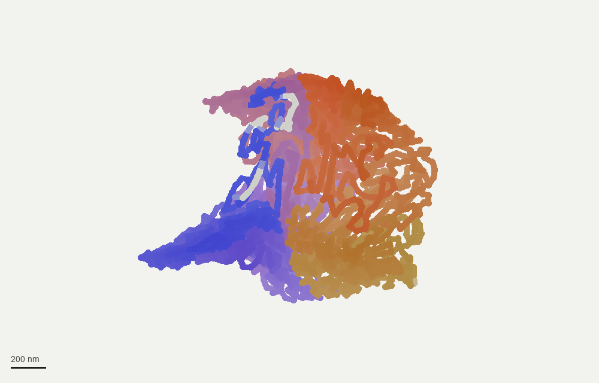
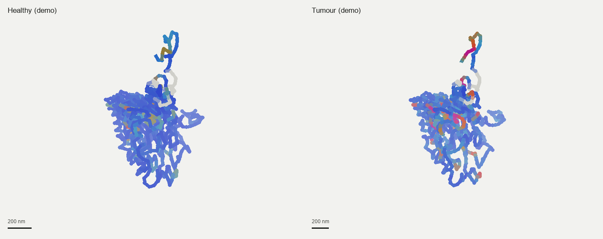
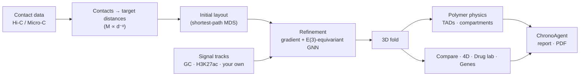

# ChronoCell-5D

**A 3D / 4D workstation for the folding of human chromosomes.** It rebuilds how a chromosome is folded inside the nucleus from contact data, follows the fold through time and disease, places every gene on it, simulates epigenetic drug mechanisms, and explains the results in plain language.


<p align="center">
  
  <br>
  <sub>The long arm of chromosome 22 (18–51 Mb) as a 3D fold, coloured from one end of the DNA to the other. Rendered from the app's built-in synthetic reference model.</sub>
</p>

---

## Contents

- [Why it matters](#why-it-matters)
- [What you can do](#what-you-can-do)
- [Quick start](#quick-start)
- [How it works](#how-it-works)
- [Accuracy](#accuracy)
- [Bring your own data](#bring-your-own-data)
- [ChronoAgent: optional AI key](#chronoagent-optional-ai-key)
- [Command line](#command-line)
- [Project layout](#project-layout)
- [Documentation](#documentation)
- [Limitations](#limitations)
- [Licence](#licence)

---

## Why it matters

Every human cell packs about two metres of DNA into a nucleus a few micrometres across. **How that DNA is folded decides which genes can be read.** Misfolding and rearrangements are involved in cancer, cellular ageing and some neurodegenerative diseases.

The fold can't be photographed directly across a whole chromosome. Experiments such as Hi-C and Micro-C instead measure which pieces of DNA touch. ChronoCell-5D turns those measurements into a 3D structure and puts the tools to study it in one place.

## What you can do

| Page | What it does |
|---|---|
| **01 · 3D structure** | Rotate the fold, and read its size, span and activity signal. Colour it by position, activity mark, A/B compartment or TAD neighbourhood. Measure it with polymer physics, rebuild it from contacts, and export it. |
| **02 · 4D dynamics** | Play time courses, or morph Healthy → Disease → Senescent. Simulate rearrangements (22q11.2 deletion, the Philadelphia chromosome, the Ewing sarcoma fusion, SNCA triplication), and export movies and GIFs. |
| **03 · Compare** | Two states side by side, with linked cameras. Every piece of DNA is coloured by how far it moved, alongside the genes in the most-changed regions. |
| **04 · Drug lab** | Apply an epigenetic drug mechanism (EZH2/EED, HDAC or BET inhibitor, or a loop stabiliser), drag the dose slider, and measure how far the fold moves back toward healthy. |
| **05 · Genes** | All 19,386 human genes placed on the fold, labelled predicted active or silenced from 3D accessibility. Shows which genes touch in 3D, and checks predictions against RNA-seq. |
| **06 · Guide** | A plain-language guide to every page and number. |
| **🤖 ChronoAgent** | Reads the measurements on screen and writes an interpretation. Exports a Markdown report, a PDB structure and a PDF dossier. |

<p align="center">
  
  <br>
  <sub>The Compare page idea: the same 8 Mb region in a healthy and a tumour fold, coloured by activity signal (blue low, magenta high). These are the app's synthetic demo patients.</sub>
</p>

## Quick start

```bash
git clone https://github.com/Sh1voham/ChronoCell-5D.git
cd ChronoCell-5D
pip install -r requirements.txt
streamlit run app.py
```

The app opens at <http://localhost:8501> with a clearly labelled synthetic reference chromosome.

To explore every page without data, open the sidebar and switch on **Load demo patients (synthetic)**. This adds a healthy, a tumour and a senescent chr22. They are generated locally and labelled as demo data everywhere.

PyTorch is only needed to reconstruct structures; the viewer, analytics and exports run without it.

## How it works



1. **Contacts become distances.** DNA pieces that touch often must be close in space.
2. **A first 3D layout** satisfies those distances as well as possible.
3. **Refinement** pulls the layout into a physically valid chain: fixed spacing along the DNA, no two pieces overlapping. An E(3)-equivariant graph neural network gives the same answer however the structure is rotated or mirrored.
4. **Analysis** measures the fold: size, compaction, crowding, contact decay, TAD boundaries and A/B compartments. The other pages and ChronoAgent build on these measurements.

Heavy reconstructions can run on a free Google Colab GPU with [`colab/ChronoCell5D_Colab.ipynb`](colab/ChronoCell5D_Colab.ipynb). Its output unzips straight into `coordinates/`.

## Accuracy

The reconstruction was tested against **real microscopy**: chromatin tracing from Bintu et al., *Science* 2018. That data gives the measured 3D position of every 30 kb piece of DNA in thousands of human cells.

**How it was tested:**
1. The cells were split into two halves.
2. The model saw only contact frequencies from the first half.
3. It was scored against distances measured in the second half, which it never saw.

Two scores are kept separate:
- **Contact-map fit**: agreement with the input, which only shows the fit converged.
- **Microscopy accuracy**: agreement with unseen measurements, which is the real test.

Settings were tuned on separate practice datasets (K562, HCT116). The three test datasets below were
run once, afterwards.

| Test dataset | v3.2 single structure | **v3.3 population model** |
|---|---|---|
| IMR90, chr21:28–30 Mb | 39 % | **88 %** |
| A549, chr21:28–30 Mb | 54 % | **91 %** |
| IMR90, chr21:18–20 Mb (weak structure, ceiling 0.25) | 35 % | 54 % (±11) |
| **Overall** (Σ model / Σ ceiling, rule fixed in advance) | **45 %** | **85.6 %** |

Each percentage is the share of the folding pattern recovered, beyond the obvious "further along the
DNA = further apart" trend, relative to how well the experiment agrees with itself.

**What the numbers mean:**
- **Why v3.3 works.** v3.3 models a *population* of structures, because every cell folds
  differently. It uses a maximum-entropy polymer ensemble, following HIPPS/DIMES by Shi & Thirumalai,
  with 100 exact Langevin trajectories. A single 3D structure cannot reproduce population statistics.
- **Size and ranking.** Absolute sizes now match (Lin's CCC 0.93–0.97). On the two structured
  regions, raw rank agreement beats a distance-only guess.
- **Where it falls short.** On the weak-structure region, raw ranking stays below that guess
  (0.87 vs 0.96).
- **Where it runs today.** The population model is `chronocell/ensemble.py` and runs on windows of
  up to a few hundred beads. It is not yet built into the app's pages; the app's whole-chromosome
  view still uses the v3.2 single structure.

Method, full numbers and limitations: [`validation/RESULTS.md`](validation/RESULTS.md). Rerun with `python validation/validate_tracing.py`.

## Bring your own data

Files are recognised **by their content**, not their name, and assigned to *Healthy*, *Disease / Cancer* or *Senescent* by words in the file or folder name. You can also upload files straight into a state from the sidebar.

| You have | Formats |
|---|---|
| 3D coordinates | `.npy` (N×3 or T×N×3), `.pdb`, `.npz`, `.xyz`, `.csv` |
| Activity / ChIP / ATAC signal | `.npy` (one value per bead), `.bedGraph`, `.bed`, `.bigWig`¹ |
| Hi-C / Micro-C contacts | `.cool`, `.mcool`, `.hic`², text tables (`bin bin count`, positions, BEDPE) |
| RNA-seq expression | `.csv` / `.tsv` (gene, value) |

¹ needs `pyBigWig` · ² needs `hic-straw`, or convert with `hic2cool`

Put files in `coordinates/<chromosome>/` (see [`coordinates/README.md`](coordinates/README.md)) or use the sidebar and the *Data* menu.

## ChronoAgent: optional AI key

ChronoAgent works **offline by default**: a rule-based engine answers instantly from the measurements. For free-form answers, add a free **Google AI Studio (Gemini)** or **OpenRouter** key, in either of two ways:

- **Per session:** paste it into the sidebar field **AI API Key**.
- **Permanently:** copy `.streamlit/secrets.toml.example` to `.streamlit/secrets.toml` and set `GEMINI_API_KEY` or `OPENROUTER_API_KEY`. That file is git-ignored.

The key is sent only to the provider you choose, in a request header, and is never shown on screen or written into reports.

## Command line

```bash
python -m chronocell.build_graph --fasta chr22.fa --bigwig H3K27ac.bigWig --mcool sample.mcool --out graph.npz
python -m chronocell.build_graph --synthetic --out graph.npz     # no downloads needed
python -m chronocell.train --graph graph.npz --out predicted_coords.npz
python -m chronocell.benchmark                                   # accuracy on synthetic structures
python -m chronocell.demo_states demo_states                     # write the demo patients as files
python validation/validate_tracing.py                            # accuracy against real microscopy
python -m pytest                                                 # 112 tests
```

## Project layout

```text
ChronoCell-5D/
├── app.py                  Streamlit application (entry point)
├── chronocell/             core library, no Streamlit imports
│   ├── genome.py           GRCh38 chromosomes, bands, gaps, bins
│   ├── physics.py          polymer physics: R_g, scaling, crowding, losses
│   ├── egnn.py             E(3)-equivariant GNN and structure fitting
│   ├── synthetic.py        synthetic reference model
│   ├── features.py         GC / signal binning, contact extraction
│   ├── formats.py          PDB, XYZ, bundles, graph readers
│   ├── ingest.py           BED / bedGraph / bigWig tracks, cool / mcool / hic contacts
│   ├── states.py           biological-state engine (files recognised by content)
│   ├── domains.py          TADs, A/B compartments, loops, contact decay
│   ├── genes.py            gene annotation, 3D accessibility, RNA-seq agreement
│   ├── scenarios.py        4D structural-variant simulations
│   ├── therapy.py          drug-lab mechanism model
│   ├── agent.py            ChronoAgent (offline rules + Gemini / OpenRouter)
│   ├── pdf_report.py       PDF dossier
│   ├── snapshot.py         static PNG / GIF rendering
│   ├── viz.py, theme.py    figures and design tokens
│   ├── build_graph.py, train.py, benchmark.py, colab.py, demo_states.py
│   └── data/               hg38 annotation, 19,386 genes (UCSC RefSeq Select)
├── ui/                     the six pages, sidebar and shared helpers
├── tests/                  112 tests, including end-to-end runs of every page
├── validation/             accuracy against real microscopy
├── colab/                  GPU reconstruction notebook
├── coordinates/            drop-in folder for your structures
└── docs/                   plain-language overview and images
```

## Documentation

| Document | What's in it |
|---|---|
| [`docs/OVERVIEW.md`](docs/OVERVIEW.md) | The whole project in plain language, with everyday analogies |
| [`APP_GUIDE.md`](APP_GUIDE.md) | Every screen, graph, option, file and function |
| [`ARCHITECTURE.md`](ARCHITECTURE.md) | Architecture, module reference and equations (written for the v2 design; `APP_GUIDE.md` covers the current modules) |
| [`AUDIT.md`](AUDIT.md) | Audit of the first version and the corrections made |
| [`validation/RESULTS.md`](validation/RESULTS.md) | Accuracy against real microscopy |
| [`coordinates/README.md`](coordinates/README.md) | Coordinate folder and file formats |
| [`UPDATES.md`](UPDATES.md) | Development log |

## Limitations

- **Research and education only.** This is not a diagnostic tool and not medical advice.
- **The drug lab is a mechanism simulator.** It shows what a drug's mechanism *could* do to a fold, not how well a drug works in patients.
- **Gene "active / silenced" labels are predictions** from 3D accessibility and signal. RNA-seq can be added to check them.
- **Validation so far** uses imaging-derived contacts, not sequencing Hi-C of the same cells, and absolute distances need calibration.
- **Synthetic data is labelled.** The reference model and demo patients are synthetic, and the app labels them as such everywhere.

## Licence

No licence has been chosen for this repository yet (see the open items in [`UPDATES.md`](UPDATES.md)). Until a `LICENSE` file is added, please ask the maintainers before reusing the code.

Reference data: GRCh38 annotation and genes from the UCSC Genome Browser (RefSeq Select / MANE). The validation data is from Bintu et al., *Science* 2018, via [github.com/BogdanBintu/ChromatinImaging](https://github.com/BogdanBintu/ChromatinImaging). It is downloaded on demand, not redistributed.
